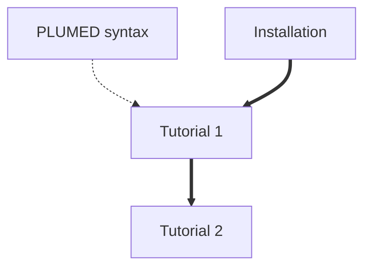

# Ensemble prediction of IDPs and multidomain proteins with bAIes and a random coil model.

## Aims

The aim of this tutorial is to learn how to use PLUMED to perform ensemble prediction of Intrinsically Disordered Proteins using Alphafold-2 outputs and bAIes.
This lesson includes two tutorials that you should try to complete yourself:
* How to run bAIes simulations to get IDP ensembles
* How to generate random coil conformations of a proteins with a random coil model

## Overview of the theory

The bAIes approach is described in the following:

V. Schnapka, T. Morozova, S. Sen, M. Bonomi. Atomic resolution ensembles of intrinsically disordered and multi-domain proteins with Alphafold. BioRxiv (2025). doi: [https://doi.org/10.1101/2025.06.18.660298](https://doi.org/10.1101/2025.06.18.660298)

## Installation instructions
Prerequisites and guide to install the software to perform bAIes simulations can be found [here](install.md).

## Resources

The data needed to complete the tutorials can be found [here](). You can clone this repository locally on your machine.

This repository contains the following 3 directories:
* `installation`: a few files to help the installation of the framework.
* `scripts`: python scripts used for preprocessing and preparation of the input files.
* `tutorials`: complete tutorials for single-structure and ensemble refinement

The example in this study is a 70 residues IDP, PaaA2. We are going to generate both a bAIes and a coil ensemble of this IDP in the two tutorials.

## Tutorial 1: Ensemble prediction with bAIes
The first tutorial to predict ensembles of IDPs with bAIes can be accessed [here](01.md).

## Tutorial 2: Random coil ensemble preparation
The second tutorial to generate random coil ensembles can be accessed [here](02.md).

## Flowchart
The flow chart shown below indicates the order in which you should consult the resources.  You can click on the nodes to access the various resources.  Follow the thick black lines for the best results.  The resources that are connected by dashed lines are supplementary resources that you may find useful when completing the exercise. 

